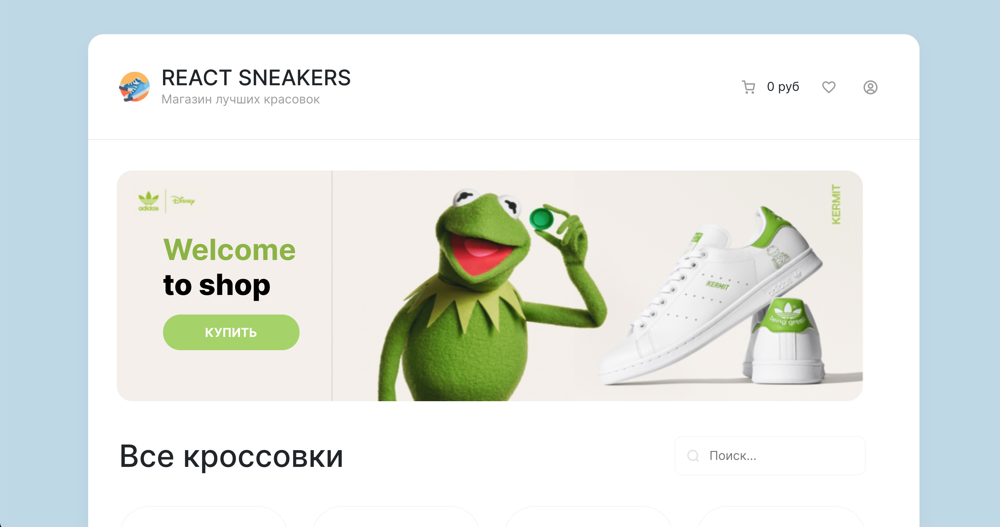
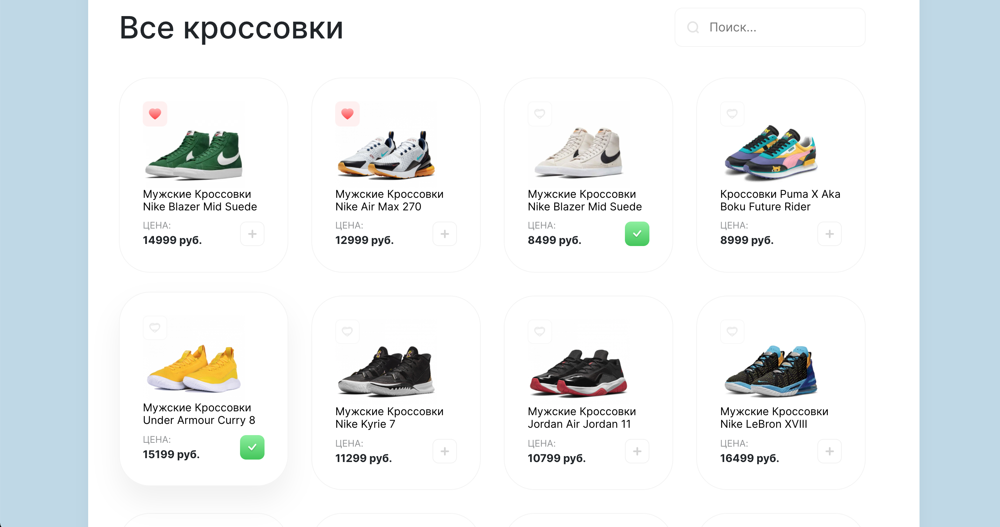
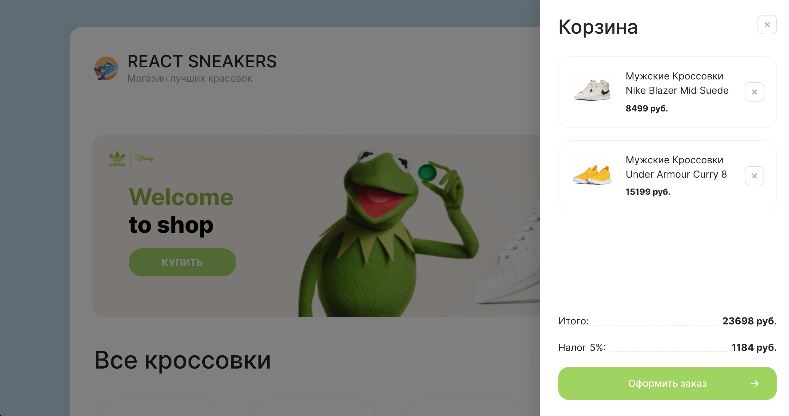

### Интернет-магазин Кроссовок

---

> Хостинг проекта
> [Ссылка на проект](https://12goroh12.github.io/react-sneakers/)

### Запустить проект

```sh
npm run start
```

:arrow_right: :arrow_right: :arrow_right:

# :camera:





**Stack:**

- [x] ReactJS + хуки
- [x] React Router
